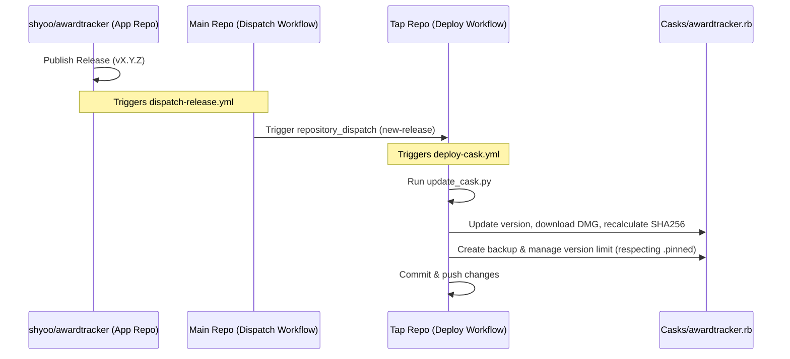

# GitHub Actions Workflows

This directory contains the automation workflows for maintaining and deploying the Homebrew Cask for **Award Tracker**.

## Overview of the Cask Release Pipeline

The deployment process follows a two-step dispatch architecture:

---

## 1. Dispatch Cask Update (`dispatch-release.yml`)

*   **Trigger:** Triggers automatically in the upstream/source repository (`shyoo/awardtracker`) whenever a new release is published.
    > [!IMPORTANT]
    > **This workflow file is placed in this tap repository for reference/backup, but it must be configured in the upstream source repository's (`shyoo/awardtracker`) `.github/workflows/` directory to function.**
*   **What it does:** Sends an authenticated HTTP POST request (Repository Dispatch event) to the Homebrew tap repository (`kevmando/homebrew-awardtracker`) with the event type `new-release` and the release version tag as payload data.
*   **Security:** Uses the token `secrets.TAP_GITHUB_TOKEN` to authenticate the request. Inputs are passed through environment variables to protect the shell context against potential script injection.

---

## 2. Deploy Cask Upgrade (`deploy-cask.yml`)

*   **Trigger:** 
    *   **Repository Dispatch:** Triggered by the `new-release` event from the dispatch workflow.
    *   **Workflow Dispatch (Manual):** Triggered manually in the GitHub Actions tab. You can optionally supply a specific version parameter.
    *   **Schedule (Daily):** Runs daily at 00:00 UTC to check for upstream updates as a fallback.
*   **What it does:**
    1.  Clones this Homebrew tap repository.
    2.  Sets up Python.
    3.  Runs `.github/scripts/update_cask.py` with the target version.
    4.  If the cask file is updated, it automatically commits and pushes the modified Cask file and backups back to this repository.

---

## The Cask Update Script (`.github/scripts/update_cask.py`)

The helper Python script automates the tedious parts of a cask update:
1.  **Format Validation:** Uses regex to validate input versions to prevent directory traversal or malicious injection.
2.  **Backups:** Creates a copy of the current version as `Casks/awardtracker@<old_version>.rb` and renames the cask inside the file to avoid duplicate definition conflicts.
3.  **Version Pinning:** Reads `Casks/.pinned` to load protected versions.
4.  **Cleanup (Retention):** Deletes older backups, maintaining a maximum of **5 unpinned versions** (this limit can be adjusted at [update_cask.py:L142-L143](../scripts/update_cask.py#L142-L143)) while protecting pinned versions from deletion.
5.  **Download & SHA256:** Downloads the corresponding macOS DMG setup asset from the upstream release to compute its SHA-256 hash.
6.  **Cask Upgrades:** Writes the new version number and calculated SHA-256 checksum to `Casks/awardtracker.rb`.

---

## Setup & Configuration

To make this pipeline function, you must add the following secret in your repository:

*   **`TAP_GITHUB_TOKEN`**: A GitHub Personal Access Token (PAT) with write permissions to the Homebrew tap repository. This is used by the dispatch workflow to notify the tap repository.
