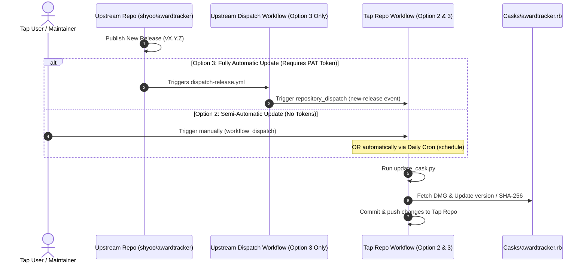

# GitHub Actions Workflows

This directory contains the automation workflows for maintaining and deploying the Homebrew Cask for **Award Tracker**.

Depending on your preference for automation and security (token sharing), you can configure your personal tap repository in one of three ways:

1.  **Option 1: Manual Cask Management** (No automation, safest)
2.  **Option 2: Semi-Automatic Update** (Option 1 + Local schedule/manual workflow, safe)
3.  **Option 3: Fully Automatic Update** (Option 1 + Option 2 + Upstream webhook dispatch, maximum automation)

---

## Step-by-Step Setup

### Step 1: Base Tap Setup (Option 1 - Manual Cask Management)

To set up a basic Homebrew Tap repository for manual Cask management from scratch:

1.  Create a new **public** repository on GitHub. To use the shorthand `brew tap <your-username>/awardtracker` installation command, the repository name **must** start with `homebrew-`. Name it: `homebrew-awardtracker`.
2.  Clone your new repository locally:
    ```bash
    git clone https://github.com/<your-username>/homebrew-awardtracker.git
    cd homebrew-awardtracker
    ```
3.  Create a `Casks` folder and place `Casks/awardtracker.rb` in it (refer to [Casks/awardtracker.rb](../../Casks/awardtracker.rb) for the cask template file).
4.  Commit and push the initial structure:
    ```bash
    git add .
    git commit -m "Initialize tap repository structure"
    git push
    ```
5.  **Managing Updates:** Whenever a new release of `awardtracker` is published:
    - Get the SHA-256 checksum of the new `awardtracker-macos-setup-v<version>.dmg` asset. You can either:
      - Copy it directly from the GitHub [releases page](https://github.com/shyoo/awardtracker/releases) (if provided in the release notes or as a `.sha256` asset).
      - Or download the DMG file and calculate it locally in your terminal:
        ```bash
        shasum -a 256 awardtracker-macos-setup-v<version>.dmg
        ```
    - Open `Casks/awardtracker.rb` in your editor and update the `version` and `sha256` fields with the new values.
    - Commit and push the changes:
      ```bash
      git add Casks/awardtracker.rb
      git commit -m "Update awardtracker to <version>"
      git push
      ```

---

### Step 2: Add Semi-Automation (Option 2 - Trigger & Schedule)

*Builds on top of Step 1.* To configure your repository to update the Cask automatically on a schedule or via manual UI triggers (without needing any Personal Access Tokens):

1.  Copy the `.github/` folder structure (including `.github/workflows/deploy-cask.yml` and `.github/scripts/update_cask.py`) from this template repository into your own repository.
2.  In GitHub, go to your **personal tap repository's Settings** -> **Actions** -> **General**:
    - Under **Workflow permissions**, select **Read and write permissions** (this allows the GitHub Actions runner to commit the cask changes back to the repository).
    - Click **Save**.
3.  **To run the update manually:**
    - Go to the **Actions** tab of your tap repository on GitHub.
    - Select **Deploy Cask Upgrade** in the sidebar.
    - Click the **Run workflow** dropdown, optionally enter a version to deploy, and click **Run workflow**.
4.  **To rely on the schedule:**
    - The workflow will run automatically every day at 00:00 UTC, check for updates, and update the cask if a new version is available upstream.

---

### Step 3: Add Full Automation (Option 3 - Instant Dispatch Upgrade)

*Builds on top of Steps 1 and 2.* To make the Cask update instantly whenever a release is published in the source repository:

1.  **Create a Personal Access Token (PAT):**
    - Go to your GitHub profile settings -> **Developer settings** -> **Personal access tokens** -> **Fine-grained tokens** (recommended).
    - Click **Generate new token**.
    - Name it something descriptive like `Award Tracker Tap Dispatcher`.
    - Under **Repository access**, select **Only select repositories** and choose **your personal tap repository** (e.g., `your-username/homebrew-awardtracker`).
    - Under **Permissions**, click **Repository permissions**:
      - Set **Contents** to **Read and write** (this grants the token permission to trigger repository dispatch events on that repository).
    - Click **Generate token** and copy it securely.
2.  **Add the Secret to the Source Repository:**
    - Go to the **source repository** page on GitHub (either `shyoo/awardtracker` if you have write access to it, or **your own fork** of it).
    - Go to **Settings** -> **Secrets and variables** (in the sidebar) -> **Actions**.
    - Click **New repository secret**.
    - Set the **Name** to: `TAP_GITHUB_TOKEN`.
    - Paste your copied token into the **Value** field.
    - Click **Add secret**.
3.  **Add the Dispatch Workflow to the Source Repository:**
    - Copy the contents of the reference file [.github/workflows/dispatch-release.yml](dispatch-release.yml) from your tap repository.
    - In the **source repository** (either the main repo or **your own fork**), create a new file at `.github/workflows/dispatch-release.yml`.
    - In that file, update the repository dispatch URL on line 25 to point to your personal tap repository:
      ```yaml
      https://api.github.com/repos/YOUR_GITHUB_USERNAME/homebrew-awardtracker/dispatches
      ```
    - Paste the contents, commit, and push it.

> [!IMPORTANT]
> **The `dispatch-release.yml` file is placed in this tap repository for reference/backup, but it must be configured in the upstream source repository (or your fork of it) to function.**

---

## Pinning Stable Versions (Excluding from Cleanup)

By default, the update script keeps only the **5 most recent backup files** (`Casks/awardtracker@<version>.rb`) and automatically deletes the oldest ones. 

If you want to protect specific stable versions (such as a key milestone release) from being deleted during cleanup, you can pin them:

1.  Open the [Casks/.pinned](../Casks/.pinned) file in your tap repository.
2.  Add the version number (e.g., `1.3.0`) on its own line.
3.  You can add comments starting with `#`.

**Example:**
```text
# Stable releases
1.2.0
1.3.0
```

Any backup file matching a version listed in `.pinned` will be skipped during the cleanup phase and will remain in the repository forever.

---

## Workflow Details

### 1. Cask Deploy/Upgrade (`deploy-cask.yml`)
*   **Trigger:** Repository Dispatch (`new-release`), manual trigger (`workflow_dispatch`), or daily cron (`schedule`).
*   **Job Details:** Clones the repository, sets up Python, runs the update script, and commits/pushes the updated cask file along with any backup files.

### 2. Cask Update Script (`.github/scripts/update_cask.py`)
This helper script automates the update process:
1.  **Format Validation:** Uses regex to validate input versions to prevent directory traversal or malicious injection.
2.  **Backups:** Creates a copy of the current version as `Casks/awardtracker@<old_version>.rb`.
3.  **Version Pinning:** Reads `Casks/.pinned` to load protected versions that will never be deleted.
4.  **Cleanup (Retention):** Deletes older backups, maintaining a maximum of **5 unpinned versions** (this limit can be adjusted at [update_cask.py:L142-L143](../scripts/update_cask.py#L142-L143)).
5.  **Download & SHA256:** Downloads the macOS DMG setup from the upstream release to compute its SHA-256 hash.
6.  **Cask Upgrades:** Writes the new version number and calculated SHA-256 checksum to `Casks/awardtracker.rb`.

### 3. Cask Release Dispatcher (`dispatch-release.yml`)
*   **Trigger:** Release published in the source repository.
*   **Job Details:** Uses the `TAP_GITHUB_TOKEN` to call GitHub's repository dispatch API, sending the published tag name to the tap repository. Inputs are safely passed via environment variables to prevent command injection.

---

## Cask Upgrade Sequence Diagram

This diagram shows how both **Semi-Automatic (Option 2)** and **Fully Automatic (Option 3)** update processes run in GitHub Actions:



